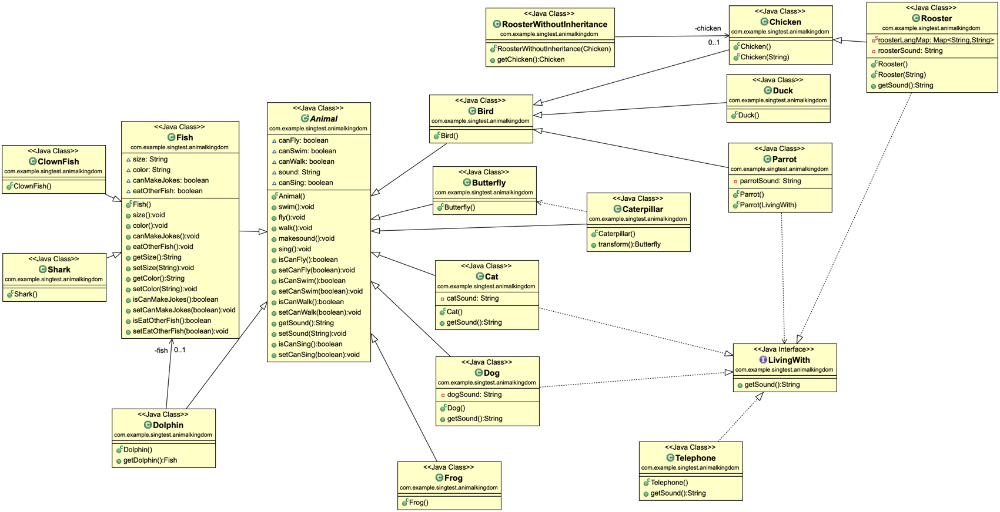

<!DOCTYPE html>
<html>

<head>
  <meta charset="utf-8">
  <meta name="viewport" content="width=device-width, initial-scale=1.0">
  <link rel="stylesheet" href="https://stackedit.io/style.css" />
</head>

<body class="stackedit">
  
<h1 id="singteltest">singteltest</h1>

<strong>Environment</strong> 
JDK 1.8.0_201, apache-maven-3.6.1, spring-boot 2.7.4

<strong>Build and run test cases</strong> 
mvn clean install

<strong>Launch Application</strong> 
mvn spingboot-run

<strong>Test REST service</strong> 
curl --location --request GET 'http://localhost:8080/animal/Duck' 
curl --location --request GET 'http://localhost:8080/animal/Butterfly' 
curl --location --request GET 'http://localhost:8080/animal/Lion' 
curl --location --request GET 'http://localhost:8080/animal/Shark'

<strong>Run Solution</strong> 
All the unit test cases can be executed in “Solution” class.

<strong>Junit Testcases</strong> 
All the Junit test cases were executed in “SingTestApplicationTests” class.

<strong>Class Diagram</strong> 

</body>

</html>
